# WP Manager Pro

> A comprehensive, agency-ready WordPress management suite — built with React 19, TypeScript, and the WordPress REST API.


---

## Screenshots

| Dashboard | Plugin Manager |
|-----------|---------------|
| 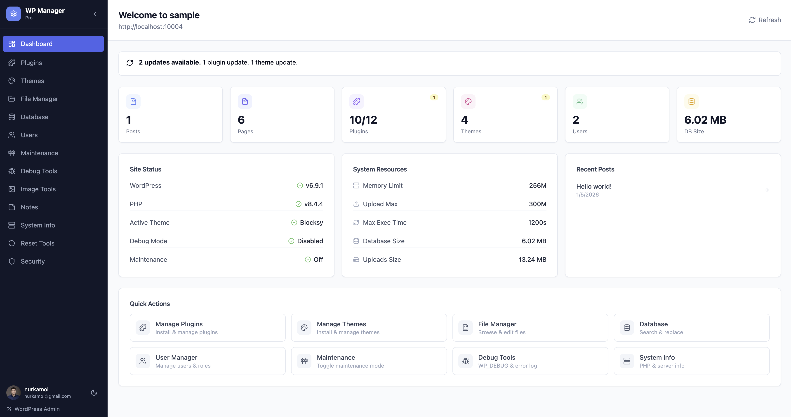 | 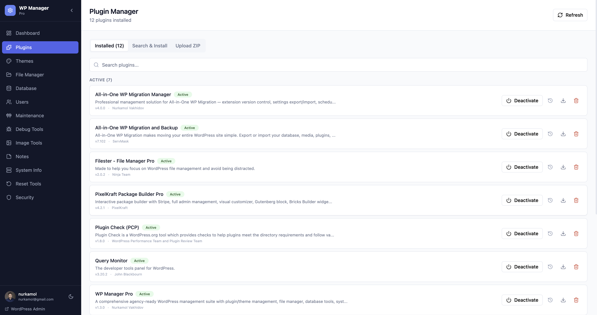 |

| Theme Manager | File Manager |
|--------------|-------------|
| 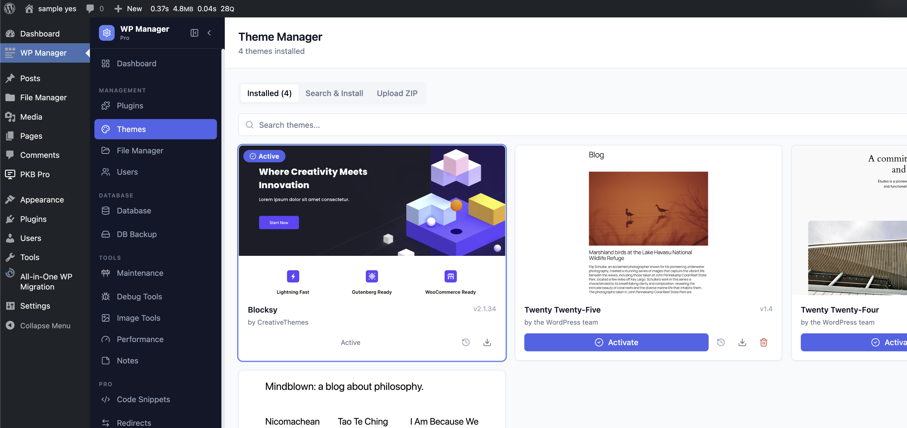 | 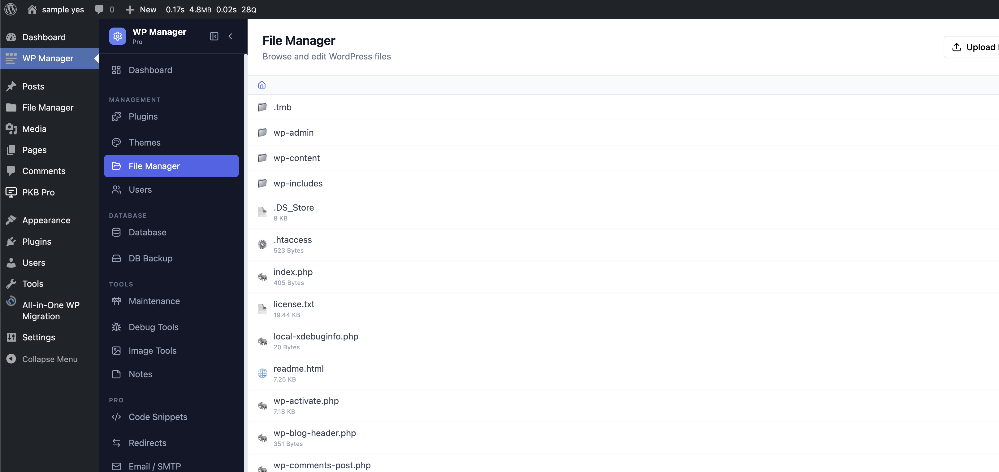 |

| Database Manager | User Manager |
|-----------------|-------------|
| 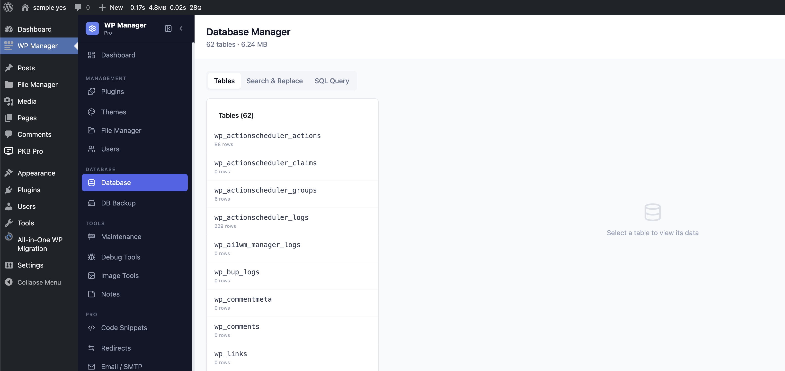 | 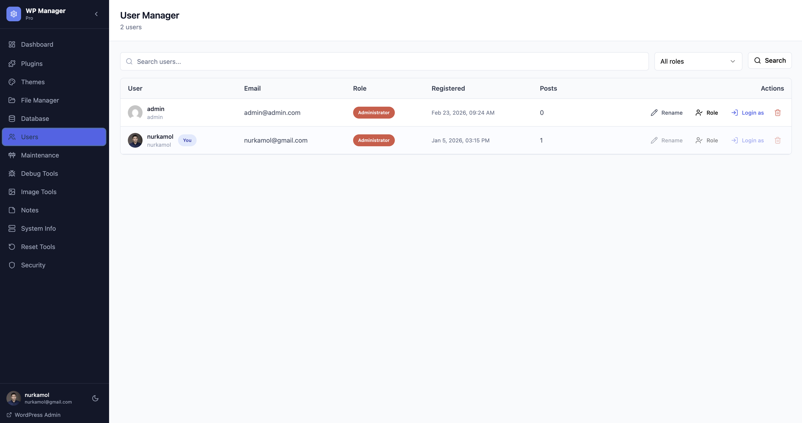 |

| Maintenance Mode | Debug Tools |
|-----------------|------------|
| 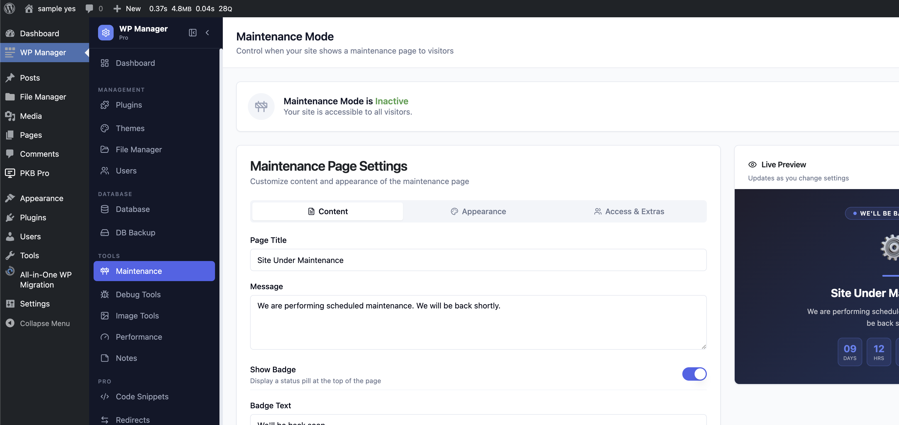 | 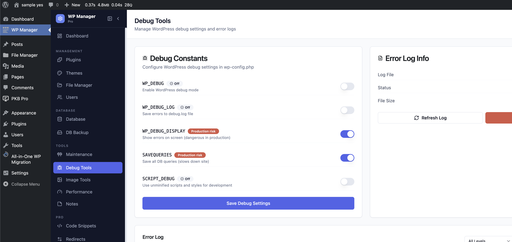 |

| Image Tools | Performance |
|------------|-------------|
| 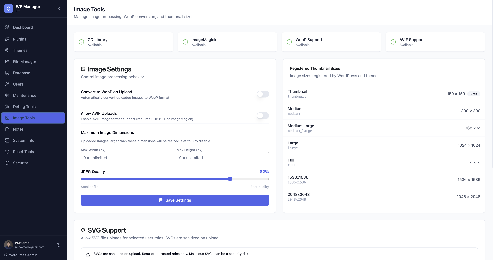 | 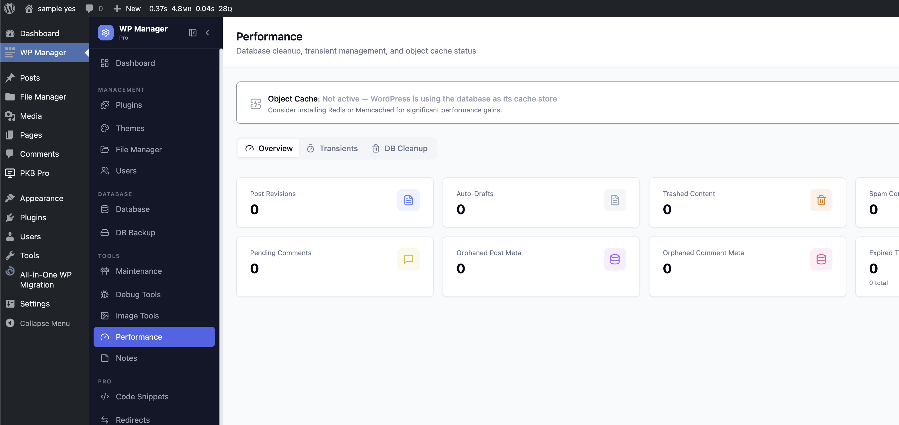 |

| System Info | Reset Tools |
|------------|------------|
| 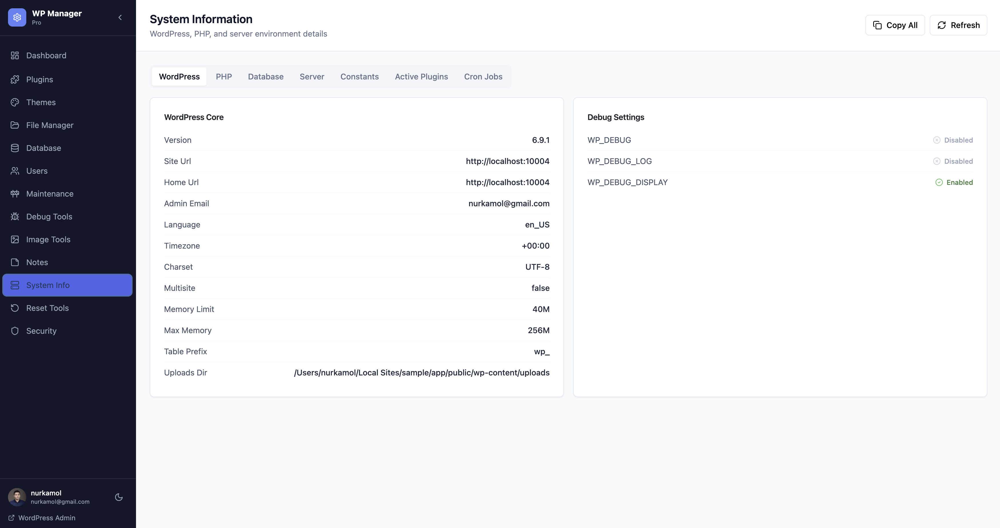 | 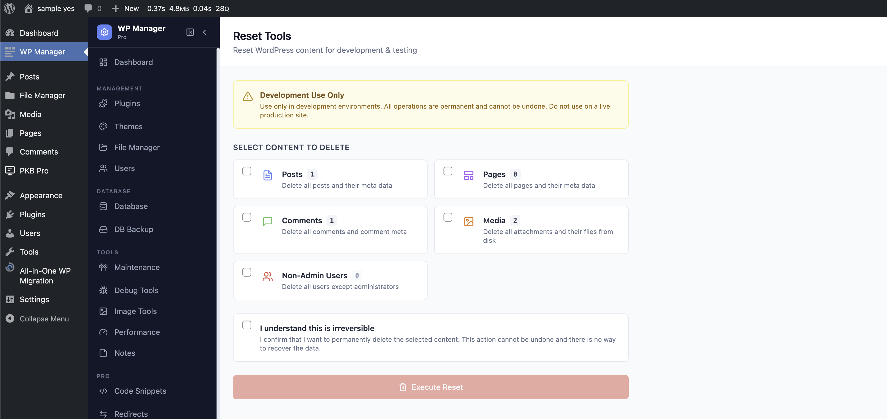 |

| Security | Settings |
|---------|---------|
| 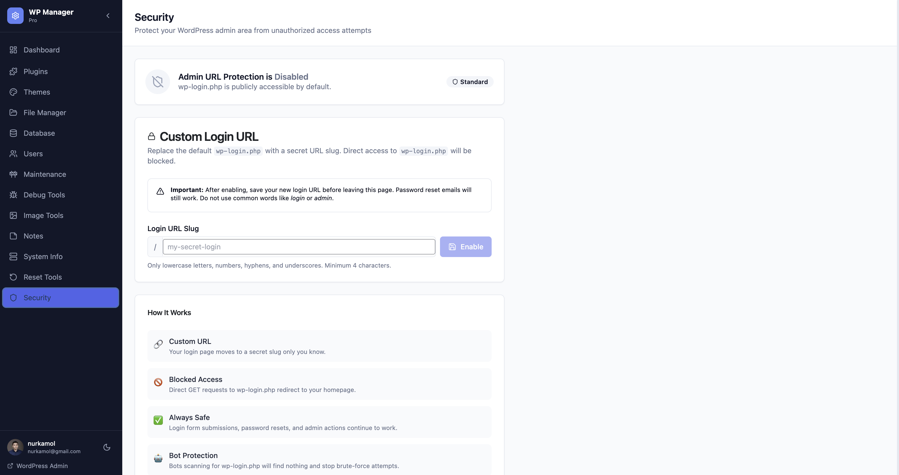 | 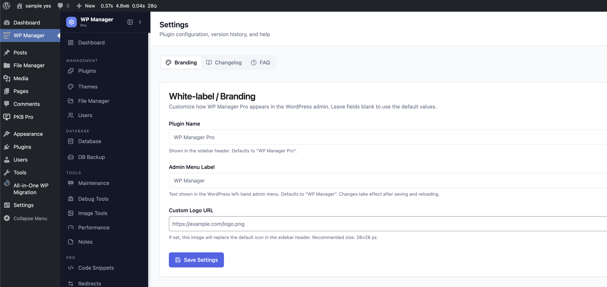 |

| Cron Manager | Media Manager |
|-------------|--------------|
| 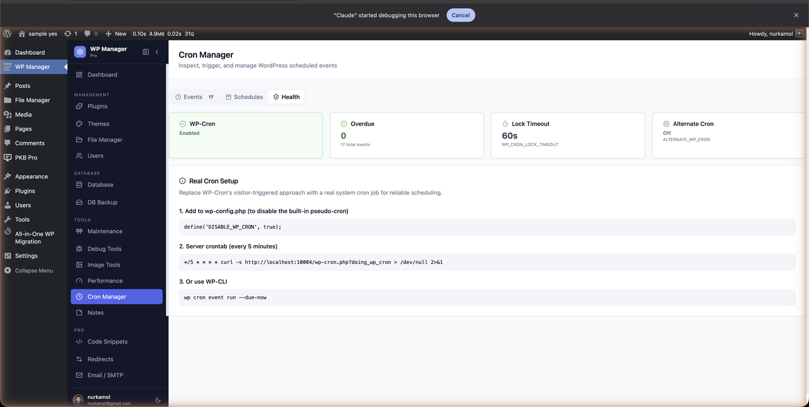 | 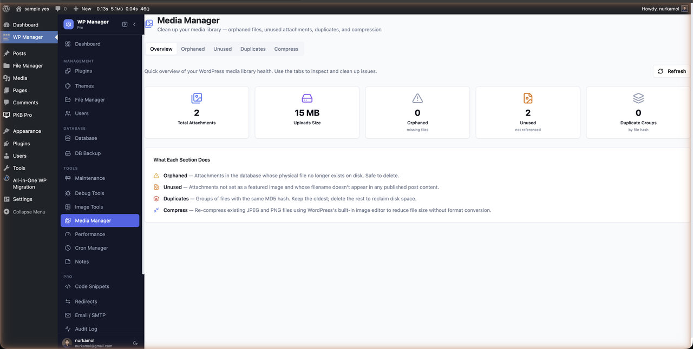 |

| Content Tools | Notes |
|--------------|-------|
| 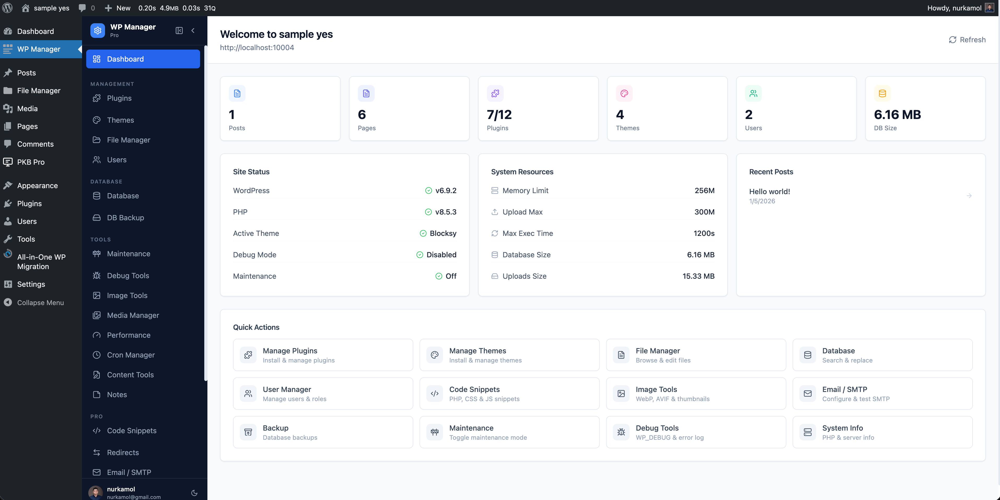 | 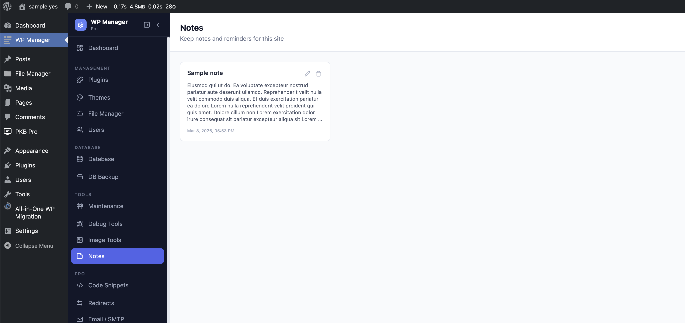 |

---

## Overview

**WP Manager Pro** replaces the need for multiple separate admin plugins by providing a single, fast, modern interface for managing every critical aspect of a WordPress site. It ships as a standard WordPress plugin — install it, activate it, and a full React-powered control panel appears under your WP Admin menu.

All operations happen through a secured REST API (`wp-manager-pro/v1`) that requires the `manage_options` capability on every route.

---

## What's New in v2.4.0 — Dev Tools

| Feature | Description |
|---------|-------------|
| 🔴 Bundled Redis drop-in | Installs its own `object-cache.php` — no third-party redis-cache plugin required; works with PhpRedis out of the box |
| 📊 Object Cache tab | Overview: status rows, connection details, live Redis stats (hit ratio, keys, memory, uptime, clients, ops/sec) + per-request WP cache stats; Diagnostics tab with full text dump |
| ⚡ Redis admin bar node | Green pulsing dot + Redis version badge in WP admin bar; sub-items: **Flush Cache** (AJAX with "Redis cache cleared" toast) and **Object Cache Settings** link |
| 🔧 Maintenance bar setting | "Show Toggle in Admin Bar" toggle in Access & Extras — hidden by default on fresh installs; custom `?wmp_preview=` slug for bypass URL |
| 🛠️ Bug fixes | Asset cache-busting via `filemtime()`, maintenance booleans stored as 0/1, page reloads after save so admin bar updates instantly |

---

## Features

### Dashboard
- Real-time site health at a glance
- Active plugin/theme/user counts
- Available update alerts (core, plugins, themes)
- PHP memory limit, max execution time, upload limit
- Database size, uploads folder size, disk usage
- Recent posts summary

### Plugin Manager
- List all installed plugins with activation status and pending updates
- Activate / deactivate with instant feedback
- Delete plugins (with auto-deactivation guard)
- Upload a `.zip` to install or overwrite an existing plugin
- Export any installed plugin as a `.zip` download
- Search and install directly from the WordPress.org repository
- **v1.2.0** One-click update button on plugins with available updates
- **v1.2.0** Version History dialog — browse and install any version from WordPress.org
- **v1.2.0** Smart WP.org search buttons: Install / Update / Installed ✓

### Theme Manager
- Browse all installed themes with screenshots, parent/child relationships
- Activate themes with one click
- Delete inactive themes
- Upload a `.zip` to install or overwrite an existing theme
- Export any installed theme as a `.zip` download
- Search and install from WordPress.org
- **v1.2.0** One-click update button on outdated themes
- **v1.2.0** Version History dialog — install any version
- **v1.2.0** Smart WP.org search buttons

### File Manager
- Full filesystem browser starting from `ABSPATH`
- Breadcrumb navigation with file metadata (size, modified date, writable status)
- Monaco Editor (VS Code engine) with full syntax highlighting for PHP, JS, TS, CSS, JSON, SQL, YAML, HTML, SVG, Markdown, and more
- Upload files directly to any directory
- Rename files and folders in-place
- Create directories, delete files and folders
- Security: path traversal protection via `realpath()`, critical file guard, 2 MB read limit

### Database Manager
- Table browser: engine, collation, row count, size
- Paginated table data viewer
- Insert, edit, and delete individual table rows
- Export any table as a `.sql` dump download
- Search & Replace across all tables with correct serialized-data handling
- Single-table or bulk `OPTIMIZE TABLE`
- SQL query runner — `SELECT`, `SHOW`, `DESCRIBE`, `EXPLAIN` only

### User Manager
- Paginated user list with avatars, roles, registration date, post count
- Change any user's role (prevents modifying your own role)
- Rename any user's login username
- **Login As** — admin impersonation via secure one-time token (5-minute expiry)
- Delete users with post reassignment to admin
- Search and filter by role

### System Info
- WordPress: version, site/home URL, locale, charset, multisite, debug flags, memory limits
- PHP: version, OS, memory, loaded extensions
- Database: host, version, size, charset, collation
- Server: software, IP, port, protocol, HTTPS status, disk space
- Active plugins with versions, defined constants, next 20 cron jobs

### Maintenance Mode
- Toggle maintenance mode on/off instantly
- Custom title and message
- **v1.3.0** Tabbed appearance editor (Content, Appearance, Extras)
- **v1.3.0** 6 gradient presets (Midnight, Sunset, Forest, Royal, Slate, Candy)
- **v1.3.0** Custom color pickers for background gradient, accent divider, and text
- **v1.3.0** Emoji icon picker (8 presets + custom input) with floating animation
- **v1.3.0** Status badge toggle with custom text
- **v1.3.0** Countdown timer to a specified date/time
- **v1.3.0** Live preview pane — updates in real-time as you adjust settings
- **v1.3.0** Save settings independently of toggling maintenance state
- Generates a styled standalone HTML maintenance page (fully inline CSS)
- Automatically removed on plugin deactivation

### Debug Tools
- Toggle `WP_DEBUG`, `WP_DEBUG_LOG`, `WP_DEBUG_DISPLAY`, `SAVEQUERIES`, `SCRIPT_DEBUG` directly in `wp-config.php`
- Error log viewer (last N lines)
- Filter error log by level: Error, Warning, Notice, Deprecated
- Copy entire log to clipboard with one click
- Clear error log with one click
- Auto-detects `wp-content/debug.log` or PHP `error_log` path

### Image Tools
- Enable/disable WebP conversion on upload (requires GD or ImageMagick)
- **v1.3.0** Enable AVIF uploads (requires PHP 8.1+ GD `imageavif` or ImageMagick with AVIF codec)
- Set maximum image dimensions (width × height)
- Configure JPEG quality
- Regenerate all registered thumbnail sizes in bulk
- Enable SVG uploads with per-role permission control (administrator, editor, author)
- Server-side SVG sanitization (strips `<script>`, `on*` events, `javascript:` hrefs, `<foreignObject>`, `<base>`)
- Support status cards: GD, ImageMagick, WebP, AVIF
- **v1.5.0** Batch convert existing media library images to WebP or AVIF with live progress bar
- **v1.6.0** Serve WebP automatically via `wp_get_attachment_url` filter + Apache `.htaccess` rewrite rules
- **v1.6.0** Replace Original with WebP — delete original after conversion and update attachment metadata
- **v1.6.0** Auto-delete `.webp` / `.avif` sidecar files when the original attachment is deleted
- **v1.6.0** Delete all converted sidecars per format with a single button
- **v1.8.0** Server Config Generator — copy-ready Nginx & Apache snippets for WebP serving, security headers, and browser cache rules

### Settings / Branding *(New in v1.8.0)*
- White-label the plugin: set a custom Plugin Name, Admin Menu Label, and Sidebar Logo URL
- Changes take effect immediately after saving and reloading the page
- Inline **Changelog** tab — collapsible version history accordion with the current version highlighted
- **FAQ** tab with 9 common questions and a direct link to open a GitHub issue

### Code Snippets *(New in v1.4.0)*
- Run custom PHP, CSS, and JavaScript directly from the dashboard without editing files
- PHP snippets execute on `init`; CSS outputs to `wp_head`; JS outputs to `wp_footer`
- Per-snippet enable/disable toggle — no deletion required to disable
- Stored in the custom `wp_wmp_snippets` database table
- **v1.8.0** Monaco Editor (VS Code engine) in the create/edit dialog with syntax highlighting per snippet type

### Redirect Manager *(New in v1.4.0)*
- Full 301/302/307/308 redirect CRUD with source → destination mapping
- Wildcard `*` support in source paths
- Hit counter, active/inactive toggle per rule
- CSV import/export for migrating from other redirect plugins

### Email / SMTP *(New in v1.4.0)*
- Configure SMTP host, port, authentication, and encryption from the dashboard
- Send a test email to verify your configuration
- Email log: recipient, subject, status (Sent / Failed), timestamp, error message

### Database Backup *(New in v1.4.0)*
- Full or table-specific SQL dump via the browser
- Backup list with filename, size, and creation date
- One-click download and delete
- Stored in a protected `wp-content/wmp-backups/` directory
- **v1.8.0** Scheduled Backups — daily / weekly / monthly auto-backup via WP Cron; configurable retain-last-N limit; oldest files pruned automatically after each run

### Audit Log *(New in v1.4.0)*
- Tracks plugin, theme, user, and post events automatically
- Filter by action type; export to CSV; clear log

### Security *(v1.3.0 → v2.0.0 Security Suite)*

Five-tab Security Suite covering every major attack surface:

**Overview Tab**
- At-a-glance status cards for all six security features with on/off indicators
- Shows WordPress version and locale with a quick link to the Integrity tab

**Login Tab** *(v1.3.0 + v2.0.0)*
- **Admin URL Protection**: Move `wp-login.php` to a secret slug; direct GET requests blocked
- **Login Attempt Limiter**: Configurable max attempts, counting window (seconds), and lockout duration; stored via WordPress transients
- **Lockout Log**: Paginated history of IP lockouts with username, timestamp, attempt count; per-IP unlock and bulk clear

**Hardening Tab** *(New in v2.0.0)*
- **Disable XML-RPC**: One toggle to apply `xmlrpc_enabled` filter — prevents brute-force and DDoS via `xmlrpc.php`
- **Hide WordPress Version**: Removes WP version from `<meta name="generator">` and strips `?ver=X.Y.Z` from all script/style URLs
- **IP Blocklist**: Add individual IPs or CIDR ranges (e.g. `10.0.0.0/24`) with optional notes; enforced on `init` before any output; supports remove

**Integrity Tab** *(New in v2.0.0)*
- Fetches official MD5 checksums from `api.wordpress.org/core/checksums`
- Compares every file in `wp-admin/` and `wp-includes/` against expected hashes
- Reports modified files (path + actual vs. expected hash + last modified date) and missing files
- `wp-content/` excluded (user content)

**Two-Factor Auth Tab** *(New in v2.0.0)*
- TOTP-based 2FA per admin account (RFC 6238 — SHA1, 6 digits, 30-second window)
- QR code for easy scanning with Google Authenticator, Authy, or any TOTP app
- Fallback manual secret entry (base32-encoded)
- 8 one-time backup codes generated on first verification (shown once, stored as MD5 hashes)
- Per-user enable/disable; 100% native PHP — no Composer dependencies

### Cron Manager *(New in v2.1.0)*

Three-tab page for full WP-Cron control:

**Events Tab**
- Complete list of all scheduled cron events sorted by next-run timestamp
- Colour-coded next-run times: green (future), amber (< 5 min), red (overdue)
- `core` badge on WordPress core events; argument count badge on events with args
- **Manual Trigger** — run any event on demand; captures output and execution time in an inline result banner
- **Delete** custom (non-core) events with one click

**Schedules Tab**
- Lists all registered schedules (built-in + custom) with key, display name, and interval (human + raw seconds)
- **Add Custom Schedule** form: key (snake_case), display name, interval in seconds (minimum 60)
- Delete custom schedules; built-in WordPress schedules are protected

**Health Tab**
- Status cards: WP-Cron enabled/disabled (`DISABLE_WP_CRON`), overdue event count (with detail list), lock timeout (`WP_CRON_LOCK_TIMEOUT`), alternate cron (`ALTERNATE_WP_CRON`)
- Real Cron Setup guide: `wp-config.php` snippet, server crontab command (site URL pre-filled), WP-CLI command

### Media Manager *(New in v2.2.0)*

Five-tab page for media library cleanup and maintenance:

**Overview Tab** — stats cards: total attachments, uploads folder size, orphaned/unused/duplicate counts; "What Each Section Does" guide

**Orphaned Tab** — lists attachments whose physical file is missing from disk; bulk-select checkboxes; delete via `wp_delete_attachment`

**Unused Tab** — lists unattached attachments not used as featured images and not referenced in any published post content; thumbnail previews, file sizes, total MB indicator, bulk delete

**Duplicates Tab** — groups files by MD5 hash; shows wasted space per group and total wasted; one-click delete of duplicate copies (oldest kept as original)

**Compress Tab** — re-compresses JPEG and PNG files in-place via `wp_get_image_editor`; adjustable quality slider (40–100, default 82); displays before size, after size, bytes saved, and percentage saved

### Notes
- Color-coded, persistent note-taking (stored in a custom `wp_wmp_notes` table)
- Create, edit, delete notes with 6 color options
- Ordered by last updated

### Reset Tools
- Live count preview before any action (posts, pages, comments, media, non-admin users)
- Checkbox selection of which content types to reset
- Double confirmation dialog to prevent accidental data loss
- Safe deletion using WordPress core functions only
- Non-destructive to plugin settings, admin accounts, or site configuration

---

## Requirements

| Requirement | Minimum |
|-------------|---------|
| WordPress   | 5.9     |
| PHP         | 7.4     |
| MySQL/MariaDB | 5.6+  |
| Browser     | Modern (ES2020+) |

---

## Installation

### From ZIP
1. Download `wp-manager-pro-v2.1.0.zip` from the [Releases](https://github.com/nurkamol/wp-manager-pro/releases) page.
2. In WP Admin → **Plugins → Add New → Upload Plugin**.
3. Upload the ZIP and click **Install Now**, then **Activate**.
4. Navigate to **WP Manager** in the admin sidebar (or click **Open** in the Plugins list).

### Manual
```bash
unzip wp-manager-pro-v2.1.0.zip -d /path/to/wp-content/plugins/
```

Then activate via WP Admin → **Plugins**.

---

## Building from Source

### Prerequisites
```bash
node >= 18
npm >= 9
```

### Setup
```bash
git clone https://github.com/nurkamol/wp-manager-pro.git
cd wp-manager-pro
npm install
```

### Development
```bash
npm run dev
```

### Production Build
```bash
npm run build
# Outputs:
#   assets/build/index.js   (~773 kB, ~216 kB gzipped)
#   assets/build/style.css  (~51 kB, ~9 kB gzipped)
```

### Package Plugin ZIP
```bash
cd ..
zip -r wp-manager-pro-v2.1.0.zip \
  wp-manager-pro/wp-manager-pro.php \
  wp-manager-pro/includes/ \
  wp-manager-pro/assets/build/
```

---

## Tech Stack

### Frontend
| Package | Version | Purpose |
|---------|---------|---------|
| React | 19 | UI framework |
| TypeScript | 5.7 | Type safety |
| Vite | 6 | Build tool |
| Tailwind CSS | 3.4 | Utility-first styling |
| shadcn/ui | manual | Component library (Radix UI) |
| TanStack Query | v5 | Server state & caching |
| React Router | v7 | Client-side routing (HashRouter) |
| Monaco Editor | latest | VS Code editor engine (File Manager) |
| Lucide React | 0.469 | Icon set |
| Sonner | 1.7 | Toast notifications |

### Backend
| Technology | Details |
|-----------|---------|
| PHP | 7.4+ |
| WordPress REST API | Namespace: `wp-manager-pro/v1` |
| Authentication | WordPress nonce (`wp_rest`) |
| Authorization | `manage_options` capability on all routes |

---

## REST API Reference

**Base URL:** `{site_url}/wp-json/wp-manager-pro/v1`

All endpoints require a valid WordPress nonce in the `X-WP-Nonce` header.

| Method | Endpoint | Description |
|--------|----------|-------------|
| GET | `/dashboard` | Site stats & health |
| GET | `/plugins` | List all plugins |
| POST | `/plugins/activate` | Activate plugin |
| POST | `/plugins/deactivate` | Deactivate plugin |
| DELETE | `/plugins/delete` | Delete plugin |
| POST | `/plugins/install` | Install from WP.org |
| GET | `/plugins/search` | Search WP.org |
| POST | `/plugins/upload` | Upload plugin ZIP |
| GET | `/plugins/export` | Create plugin ZIP export |
| GET | `/plugins/download` | Stream plugin ZIP download |
| POST | `/plugins/update` | **v1.2.0** Update plugin to latest version |
| POST | `/plugins/install-version` | **v1.2.0** Install specific plugin version |
| GET | `/themes` | List all themes |
| POST | `/themes/activate` | Activate theme |
| DELETE | `/themes/delete` | Delete theme |
| POST | `/themes/install` | Install from WP.org |
| GET | `/themes/search` | Search WP.org |
| POST | `/themes/upload` | Upload theme ZIP |
| GET | `/themes/export` | Create theme ZIP export |
| GET | `/themes/download` | Stream theme ZIP download |
| POST | `/themes/update` | **v1.2.0** Update theme to latest version |
| POST | `/themes/install-version` | **v1.2.0** Install specific theme version |
| GET | `/files` | List directory contents |
| GET | `/files/read` | Read file content |
| POST | `/files/write` | Write file content |
| DELETE | `/files/delete` | Delete file or directory |
| POST | `/files/mkdir` | Create directory |
| POST | `/files/upload` | Upload file to directory |
| POST | `/files/rename` | Rename file or folder |
| GET | `/database/tables` | List database tables |
| GET | `/database/table-data` | Browse table rows |
| POST | `/database/search-replace` | Search & replace |
| POST | `/database/optimize` | Optimize tables |
| POST | `/database/query` | Run SQL query |
| POST | `/database/row` | Insert table row |
| PUT | `/database/row` | Update table row |
| DELETE | `/database/row` | Delete table row |
| GET | `/database/export` | Export table as SQL dump |
| GET | `/system` | System information |
| GET | `/maintenance` | Maintenance status & appearance settings |
| POST | `/maintenance/toggle` | Toggle maintenance + save settings |
| POST | `/maintenance/settings` | **v1.3.0** Save appearance settings without toggling |
| GET | `/users` | List users |
| POST | `/users/change-role` | Change user role |
| POST | `/users/login-as` | Generate login-as token |
| DELETE | `/users/delete` | Delete user |
| POST | `/users/rename` | Rename user login |
| GET | `/notes` | List notes |
| POST | `/notes` | Create note |
| PUT | `/notes/{id}` | Update note |
| DELETE | `/notes/{id}` | Delete note |
| GET | `/debug` | Debug status |
| POST | `/debug/toggle` | Toggle debug constants |
| GET | `/debug/log` | Read error log |
| DELETE | `/debug/log/clear` | Clear error log |
| GET | `/images/settings` | Image settings |
| POST | `/images/settings` | Save image settings |
| POST | `/images/regenerate` | Regenerate thumbnails |
| POST | `/images/convert` | **v1.5.0** Batch convert images to WebP/AVIF |
| GET | `/images/convert-stats` | **v1.5.0** Conversion stats (total/converted/remaining) |
| DELETE | `/images/convert` | **v1.6.0** Delete all sidecar files for a format |
| GET | `/reset/status` | Get content counts |
| POST | `/reset/execute` | Execute site reset |
| GET | `/security` | **v1.3.0** Admin URL protection status |
| POST | `/security/admin-url` | **v1.3.0** Enable/update custom login slug |
| DELETE | `/security/admin-url` | **v1.3.0** Disable admin URL protection |
| GET | `/cron/events` | **v2.1.0** List all scheduled cron events |
| POST | `/cron/run` | **v2.1.0** Trigger a cron event immediately |
| DELETE | `/cron/event` | **v2.1.0** Delete / unschedule a cron event |
| GET | `/cron/schedules` | **v2.1.0** List all registered schedules |
| POST | `/cron/schedules` | **v2.1.0** Create a custom schedule |
| DELETE | `/cron/schedules` | **v2.1.0** Delete a custom schedule |
| GET | `/cron/health` | **v2.1.0** Cron health status and real-cron hints |
| GET | `/media/overview` | **v2.2.0** Stats: total attachments, uploads size, orphaned/unused/duplicate counts |
| GET | `/media/orphaned` | **v2.2.0** List attachments with missing physical files |
| DELETE | `/media/orphaned` | **v2.2.0** Bulk delete orphaned attachments by ID array |
| GET | `/media/unused` | **v2.2.0** List unattached, unreferenced attachments with thumbnails |
| DELETE | `/media/unused` | **v2.2.0** Bulk delete unused attachments by ID array |
| GET | `/media/duplicates` | **v2.2.0** Group attachments by MD5 hash; returns wasted-space totals |
| DELETE | `/media/duplicate` | **v2.2.0** Delete a single duplicate attachment |
| GET | `/media/compress-candidates` | **v2.2.0** List JPEG/PNG attachments with file sizes |
| POST | `/media/compress` | **v2.2.0** Re-compress one attachment; returns before/after sizes |
| GET | `/security/overview` | **v2.0.0** All security feature states in one call |
| POST | `/security/limiter` | **v2.0.0** Save login limiter settings |
| GET | `/security/lockouts` | **v2.0.0** List lockout log entries |
| DELETE | `/security/lockouts` | **v2.0.0** Clear all lockout log entries |
| POST | `/security/lockouts/unlock` | **v2.0.0** Unlock a specific IP |
| GET | `/security/ip-blocklist` | **v2.0.0** List blocked IPs |
| POST | `/security/ip-blocklist` | **v2.0.0** Add IP or CIDR to blocklist |
| DELETE | `/security/ip-blocklist` | **v2.0.0** Remove IP from blocklist |
| POST | `/security/hardening` | **v2.0.0** Save XML-RPC / hide-version settings |
| POST | `/security/integrity` | **v2.0.0** Run core file integrity check |
| GET | `/security/2fa` | **v2.0.0** Get 2FA status for current user |
| POST | `/security/2fa/setup` | **v2.0.0** Generate TOTP secret + QR URL |
| POST | `/security/2fa/verify` | **v2.0.0** Verify code and activate 2FA |
| DELETE | `/security/2fa` | **v2.0.0** Disable 2FA for current user |
| GET | `/snippets` | **v1.4.0** List snippets |
| POST | `/snippets` | **v1.4.0** Create snippet |
| PUT | `/snippets/{id}` | **v1.4.0** Update snippet |
| POST | `/snippets/{id}/toggle` | **v1.4.0** Toggle snippet enabled state |
| DELETE | `/snippets/{id}` | **v1.4.0** Delete snippet |
| GET | `/redirects` | **v1.4.0** List redirects |
| POST | `/redirects` | **v1.4.0** Create redirect |
| PUT | `/redirects/{id}` | **v1.4.0** Update redirect |
| DELETE | `/redirects/{id}` | **v1.4.0** Delete redirect |
| POST | `/redirects/export` | **v1.4.0** Export redirects as CSV |
| GET | `/redirects/download` | **v1.4.0** Download CSV export |
| POST | `/redirects/import` | **v1.4.0** Import redirects from CSV |
| GET | `/email/settings` | **v1.4.0** SMTP settings |
| POST | `/email/settings` | **v1.4.0** Save SMTP settings |
| POST | `/email/test` | **v1.4.0** Send test email |
| GET | `/email/log` | **v1.4.0** Email log |
| DELETE | `/email/log/clear` | **v1.4.0** Clear email log |
| GET | `/backup` | **v1.4.0** List backups |
| POST | `/backup/create` | **v1.4.0** Create backup |
| POST | `/backup/download` | **v1.4.0** Prepare backup for download |
| GET | `/backup/serve` | **v1.4.0** Stream backup file |
| DELETE | `/backup/delete` | **v1.4.0** Delete backup |
| GET | `/backup/schedule` | **v1.8.0** Get scheduled backup config |
| POST | `/backup/schedule` | **v1.8.0** Save scheduled backup config |
| GET | `/settings` | **v1.8.0** Get branding settings |
| POST | `/settings` | **v1.8.0** Save branding settings |
| GET | `/audit` | **v1.4.0** Audit log entries |
| DELETE | `/audit/clear` | **v1.4.0** Clear audit log |
| POST | `/audit/export` | **v1.4.0** Export audit log as CSV |
| GET | `/audit/download` | **v1.4.0** Download CSV export |
| GET | `/audit/action-types` | **v1.4.0** Available action type filters |

---

## Project Structure

```
wp-manager-pro/
├── wp-manager-pro.php              # Plugin entry point, constants, activation hooks
├── includes/
│   ├── class-plugin.php            # Singleton bootstrap, hook registration
│   ├── class-admin.php             # Admin menu, asset enqueuing, plugin links
│   └── api/
│       ├── class-routes.php        # REST route registration (96 endpoints)
│       └── controllers/
│           ├── class-dashboard-controller.php
│           ├── class-plugins-controller.php
│           ├── class-themes-controller.php
│           ├── class-files-controller.php
│           ├── class-database-controller.php
│           ├── class-users-controller.php
│           ├── class-system-controller.php
│           ├── class-maintenance-controller.php
│           ├── class-debug-controller.php
│           ├── class-images-controller.php
│           ├── class-notes-controller.php
│           ├── class-reset-controller.php
│           ├── class-security-controller.php   # v1.3.0 → v2.0.0
│           ├── class-snippets-controller.php   # v1.4.0
│           ├── class-redirects-controller.php  # v1.4.0
│           ├── class-email-controller.php      # v1.4.0
│           ├── class-backup-controller.php     # v1.4.0
│           ├── class-audit-controller.php      # v1.4.0
│           ├── class-settings-controller.php   # v1.8.0
│           ├── class-cron-controller.php       # v2.1.0
│           └── class-media-controller.php      # v2.2.0
├── assets/
│   └── build/
│       ├── index.js                # Compiled React app (~793 kB, ~220 kB gzip)
│       └── style.css               # Compiled styles (~52 kB, ~9 kB gzip)
├── src/                            # React source (TypeScript)
│   ├── main.tsx
│   ├── index.css
│   ├── App.tsx
│   ├── lib/
│   │   ├── api.ts
│   │   └── utils.ts
│   ├── hooks/
│   │   └── useTheme.ts             # v1.2.0 Dark mode hook
│   ├── components/
│   │   ├── Sidebar.tsx             # Nav + dark mode toggle
│   │   ├── Layout.tsx
│   │   ├── PageHeader.tsx
│   │   ├── LoadingSpinner.tsx
│   │   └── ui/                     # shadcn components
│   └── pages/
│       ├── Dashboard.tsx
│       ├── Plugins.tsx
│       ├── Themes.tsx
│       ├── FileManager.tsx
│       ├── Database.tsx
│       ├── Users.tsx
│       ├── SystemInfo.tsx
│       ├── Maintenance.tsx         # v1.3.0 appearance + v1.5.0 scope/bypass
│       ├── Debug.tsx
│       ├── ImageTools.tsx          # v1.3.0–1.6.0 full WebP/AVIF pipeline
│       ├── Notes.tsx
│       ├── Reset.tsx
│       ├── Security.tsx            # v1.3.0 → v2.0.0 Security Suite
│       ├── Cron.tsx                # v2.1.0 Cron Manager
│       ├── MediaManager.tsx        # v2.2.0 Media Manager
│       ├── Snippets.tsx            # v1.4.0
│       ├── Redirects.tsx           # v1.4.0
│       ├── Email.tsx               # v1.4.0
│       ├── Backup.tsx              # v1.4.0
│       ├── AuditLog.tsx            # v1.4.0
│       └── Settings.tsx            # v1.8.0
├── releases/
│   ├── v1.0.0.md
│   ├── v1.1.0.md
│   ├── v1.2.0.md
│   ├── v1.3.0.md
│   ├── v1.4.0.md
│   ├── v1.5.0.md
│   ├── v1.6.0.md
│   ├── v1.8.0.md
│   ├── v1.9.0.md
│   ├── v2.0.0.md
│   └── v2.1.0.md
├── vite.config.ts
├── tailwind.config.js
├── tsconfig.json
├── package.json
├── CHANGELOG.md
└── README.md
```

---

## FAQ

### How do I open WP Manager Pro?
After activating the plugin, click **WP Manager** in the WordPress admin sidebar, or click the **Open** link in the Plugins list row next to WP Manager Pro.

### Who can access WP Manager Pro?
Only WordPress users with the `manage_options` capability (Administrators). Every REST API endpoint enforces this — lower-privileged users receive a `403 Forbidden` response.

### How do I put my site in maintenance mode?
Go to **Maintenance** in the sidebar. Use the **Content** tab to set your title and message, the **Appearance** tab to choose a gradient and icon, and the **Extras** tab to add a countdown timer. Click **Enable Maintenance** to go live, or **Save Settings** to persist your design without changing the active state. The maintenance page is removed automatically when you disable it or deactivate the plugin.

### How do I downgrade a plugin or theme to an older version?
In **Plugin Manager** or **Theme Manager**, click the clock/history icon (⏱) on any plugin or theme row. A dialog loads all available versions from WordPress.org. Click **Install** next to the version you want — the plugin/theme stays active after the switch.

### How do I hide the WordPress login page?
Go to **Security → Login** tab. Enter a secret slug (e.g. `my-secret-login`) and click **Enable Protection**. Your login page moves to `yoursite.com/my-secret-login`. Direct GET requests to `wp-login.php` are redirected to the homepage. Copy the new URL with the clipboard button before saving. To restore the default, click **Disable Protection**.

### How do I block brute-force login attacks?
Go to **Security → Login** tab. Enable the **Login Attempt Limiter** and set your desired max attempts, counting window (seconds), and lockout duration (seconds). When an IP exceeds the limit it is automatically blocked; you can view and unlock locked-out IPs in the **Lockout Log** section below.

### How do I block a specific IP or IP range?
Go to **Security → Hardening** tab. Enter an IP address (e.g. `203.0.113.5`) or a CIDR range (e.g. `10.0.0.0/24`) in the IP Blocklist, add an optional note, and click **Add**. Blocked IPs are rejected on WordPress's `init` hook before any output is sent.

### How do I verify my WordPress core files haven't been tampered with?
Go to **Security → Integrity** tab and click **Run Integrity Check**. WP Manager Pro fetches the official MD5 checksums from wordpress.org and compares every file in `wp-admin/` and `wp-includes/`. Any modified or missing files are listed with their actual hash, expected hash, and last-modified date.

### How do I enable Two-Factor Authentication?
Go to **Security → Two-Factor** tab and click **Set Up Two-Factor Auth**. Scan the QR code with Google Authenticator, Authy, or any TOTP app, then enter the 6-digit code to verify and activate. Eight one-time backup codes are generated and shown once — save them somewhere safe. To disable 2FA, click **Disable 2FA** on the same tab.

### How do I enable WebP or AVIF image uploads?
Go to **Image Tools** and toggle **WebP Conversion** or **AVIF Support** on. WebP requires GD or ImageMagick. AVIF requires PHP 8.1+ with GD (`imageavif` function) or ImageMagick compiled with the AVIF codec. The support status cards at the top of the page show what your server supports.

### How do I use Login As (admin impersonation)?
Go to **Users**, find the user you want to impersonate, and click the person/arrow icon. WP Manager Pro generates a secure single-use token (valid for 5 minutes) and redirects you to WP Admin logged in as that user. Only existing admins can trigger this — the token is validated server-side and deleted on first use.

### Is it safe to edit files with the File Manager?
Yes — all file paths are validated against `ABSPATH` using `realpath()` to prevent path traversal. `wp-config.php`, `.htaccess`, and `index.php` are write-protected from deletion and rename. The editor is limited to text-based file types and a 2 MB read limit. That said, treat it like any code editor: incorrect edits can break your site.

### Can I run custom SQL queries in the Database Manager?
The **SQL Runner** tab is read-only — it accepts `SELECT`, `SHOW`, `DESCRIBE`, and `EXPLAIN` statements only. Write operations (`INSERT`, `UPDATE`, `DELETE`, `DROP`, etc.) are blocked at the API level. For write operations, use the **Table Data** tab to insert, edit, or delete individual rows via the UI.

### How do I check for plugin/theme updates without leaving WP Manager Pro?
Click the **Check Updates** button (top-right of Plugin Manager or Theme Manager). This forces WordPress to re-query WordPress.org for fresh update data and immediately refreshes the list — no page reload needed.

### Does WP Manager Pro support WordPress Multisite?
The plugin works on Multisite but is designed for single-site use. It installs and activates on a per-site basis. Network-level management (network activation, super-admin actions) is not currently supported.

### How do I uninstall WP Manager Pro?
Deactivate the plugin from WP Admin → Plugins. On deactivation, the maintenance file (`wp-content/maintenance.php`) is automatically removed. Deactivating does **not** delete your notes or settings stored in `wp_options` — these are cleaned up if you manually delete the plugin afterward.

### Where are notes stored?
Notes are stored in a custom `wp_wmp_notes` database table created on plugin activation. They persist across plugin updates.

### Why does the page look unstyled or show a blank white area?
This can happen if another plugin or theme loads conflicting scripts on the WP Manager Pro page. Check the browser console for JavaScript errors. If you see a Content Security Policy (CSP) violation, your server's CSP headers may be blocking the inline React app. You may need to whitelist the plugin's script.

---

## Security

- All REST endpoints are protected by `manage_options` capability check
- WordPress nonce validation on every request (`wp_rest`)
- File Manager uses `realpath()` path traversal prevention — all paths must resolve inside `ABSPATH`
- Critical files (`wp-config.php`, `.htaccess`, `index.php`) are write-protected in delete and rename endpoints
- File read is limited to text-based extensions (no binary execution)
- Login-As tokens are single-use, stored in WordPress transients, expire in 5 minutes
- Database query runner is read-only (`SELECT`, `SHOW`, `DESCRIBE`, `EXPLAIN` only)
- SVG uploads are sanitized server-side: strips `<script>`, `on*` event attrs, `javascript:` hrefs, `<foreignObject>`, `<base>` tags
- Username rename validates with `sanitize_user()` + `validate_username()`, checks for conflicts
- Reset Tools requires explicit `confirm: true` flag; uses WordPress core deletion functions only
- **v1.3.0** Admin URL protection blocks GET requests to `wp-login.php` without the secret key; POST/password-reset flows are unaffected
- **v2.0.0** Login Attempt Limiter uses WordPress transients with IP-keyed lock keys; brute-force protection fires at priority 30 on the `authenticate` filter
- **v2.0.0** IP Blocklist matches exact IPs and CIDR ranges via bitwise mask comparison; enforced on `init` before any page output
- **v2.0.0** TOTP 2FA uses 100% native PHP (no Composer): `random_bytes`, `hash_hmac('sha1')`, custom base32 encoder/decoder; backup codes stored as MD5 hashes
- All user inputs are sanitized with `sanitize_text_field()`, `absint()`, `sanitize_hex_color()`, `wp_kses_post()`

---

## License

GPL v2 or later — see [LICENSE](https://www.gnu.org/licenses/gpl-2.0.html).

---

## Changelog

See [CHANGELOG.md](CHANGELOG.md) for the full version history.
